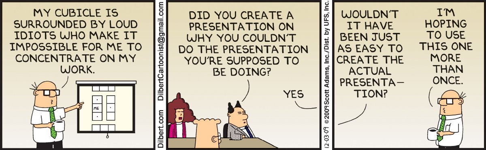

No tengo ni idea de por qué funciona la economía, pero estoy seguro de que no será porque tiene gente brillante que la dirija. Supongo que si se suman todas las actividades absurdas de la dirección empresarial, las idioteces de alguna manera se cancelan mutuamente, por lo que se pueden llegar a crear cosas fenomenales que puede usted desear comprar, como aspiradores portátiles para teclados y abrecartas electrónicos.

